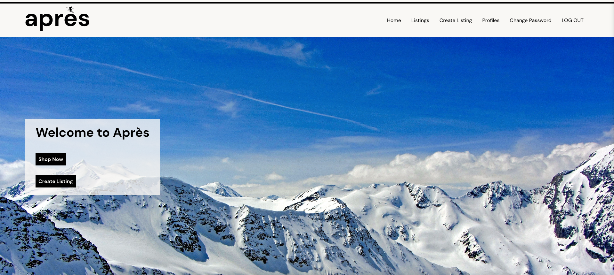

# [Après](https://apres.fly.dev/)

## [Use Après Here](https://butterapp.fly.dev/)

Everyone loves to après after a long day on the slopes but who loves trying to find quality used ski or snowboarding equipment? Après ski comes from the French word for after. After you're done enjoying your skiing or snowboarding gear what should you do with it? Après is the solution.

As an avid skier, I've always wanted a platform like Après to exist. There are all sorts of places online where you can buy and sell used items but I haven't found one that focuses on winter sports.

I created Après as a marketplace where users can create listings for the gear they no longer want. Potential buyers can filter those listings to find gear that they are looking for and connect with sellers to purchase their listings.

This is a marketplace that can eventually expand into a full e-commerce platform. For now, transactions are handled outside of the marketplace. After selecting a listing to purchase, a buyer is provided the contact information of the seller so they can connect and arrange payment/pickup or shipping.

Planning materials and original wireframes can be found [here](https://trello.com/b/SiHgbNMh/apres-planning)

## Technologies Used
* TypeScript
* React
* Express
* Node.js
* Sequelize
* Postgresql
* SWT Authentication
* JavaScript
* HTML
* CSS
* Git
* Canva

## Credits
* Snowflake icon from [Icooon Mono](https://www.svgrepo.com/author/Icooon%20Mono/) on svgrepo
* Landing page image by [Pixabay](https://www.pexels.com/@pixabay/)
* DM Sants font from [Google Fonts](https://fonts.google.com/specimen/DM+Sans?query=dm)

## Ice Box
- [ ] Allow users to review their orders from sellers
- [ ] Allow users to edit their profile
- [ ] Allow users to see a list of their orders
- [ ] Implement messaging between users
- [ ] Implement filters for state and recency for listings
